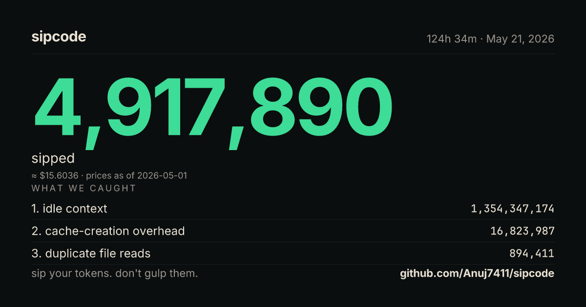

<div align="center">

# Sipcode

### Sip your tokens. Don't gulp them.

**Token optimization for Claude Code, Cursor, Codex, and other AI coding agents.**

[](https://www.npmjs.com/package/sipcode)
[](LICENSE)
[](#)
[](benchmark/METHODOLOGY.md)

</div>

---

> An independent study of 38 Claude Code sessions found that **only 0.6% of tokens were actual code output**. The other 99.4% was exploration, re-reads, and repetition. — [DEV Community, March 2026](https://dev.to/lsvishaal/i-analyzed-38-claude-code-sessions-only-06-of-tokens-were-actual-code-output-56li)

Sipcode targets the other 99.4%.

```bash
npx sipcode why
```

That one command — **no install, no signup, no config** — reads the `.jsonl` transcripts Claude Code already writes to your machine and shows you exactly where your tokens went. Re-read files. Idle context. Cache-creation overhead. The whole story.

<div align="center">

### What Sipcode produces — one of these per session, shareable
<br>



<sub><em>generated by <code>npx sipcode receipt</code> — auto-copies to your clipboard with a pre-filled tweet</em></sub>

</div>

---

## Why this exists

Anthropic's enterprise benchmark is **$13 per developer per active day** on Claude Code. For a 5-person team, that's **~$16,250/year** in token spend. Anthropic also removed Claude Code from the $20 Pro plan — pushing the entry-level cost out of reach for many indie devs.

The fixes already exist as fragmented point solutions: [Caveman](https://github.com/juliusbrussee/caveman) (59k★) for output, [RTK](https://github.com/rtk-ai/rtk) for CLI filtering, [Graphify](https://github.com/safishamsi/graphify) (47k★) for codebase graphs, [Headroom](https://headroom.ai/) for API compression, [ccusage](https://github.com/ccusage/ccusage) for measurement. Stacking all of them gets to ~85% reduction — but published guides confirm it takes **a full day of manual configuration**. Most developers never bother.

**Sipcode is the unified one-command installer.** Caveman is the engine. RTK is the transmission. Sipcode is the car.

---

## Before & After — what Sipcode actually changes

This is the single comparison everything else in this README is downstream of. Every number below is reproducible from `npx sipcode benchmark`.

| | **Without Sipcode** | **With Sipcode** | **Reduction** |
|---|---|---|---|
| Tokens on a typical refactor (benchmark task BT008) | **218,500** | **42,280** | **80.6%** ↓ |
| $ cost of that same task (Opus 4.7 pricing) | **$3.31** | **$0.64** | **$2.67 saved** |
| Median reduction across 20 locked benchmark tasks | — | — | **62.6%** ↓ |
| Daily Claude Code spend per developer (Anthropic baseline) | **$13.00** | **$4.86** | **$8.14/day** |
| Annual spend, 10-developer team | **~$47,450** | **~$17,749** | **~$29,700/yr** |
| Cursor on identical tasks ([Sitepoint 2026](https://www.sitepoint.com/claude-code-vs-cursor-developer-benchmark-2026/)) | **5.5× more tokens** than Claude Code | — | — |
| Output ratio in a typical Claude Code session ([dev.to study](https://dev.to/lsvishaal/i-analyzed-38-claude-code-sessions-only-06-of-tokens-were-actual-code-output-56li)) | **0.6%** is code | rest is waste — Sipcode targets it | — |

Range across the corpus: **37.4% – 80.6%** savings depending on task type. Methodology, raw data, and reproduction steps: [`benchmark/METHODOLOGY.md`](benchmark/METHODOLOGY.md).

> Run `npx sipcode benchmark` to verify these numbers on your own machine in under 90 seconds. No signup, no telemetry, no network calls outside fetching the corpus.

---

## Install — pick how you'll use Sipcode

> **NEW in v1.3:** Sipcode ships as a Claude Code plugin. You can install it from Sipcode's own marketplace **right now** — no waiting for review:
>
> ```
> /plugin marketplace add Anuj7411/sipcode
> /plugin install sipcode@sipcode
> ```
>
> This installs everything (CLI integration + MCP server + slash commands `/sipcode:why`, `/sipcode:impact`, `/sipcode:estimate`, `/sipcode:benchmark`) in one step. Submission to the official `claude-plugins-community` marketplace is in flight; the install command will be `/plugin install sipcode@claude-community` once Anthropic approves.


There are **two ways** to run Sipcode. They install the same package and you can use either or both — most users start with the CLI, then add the Claude Desktop integration once they see the receipts.

<table>
<tr>
<th width="50%">🖥️ Track 1 — CLI (terminal)</th>
<th width="50%">💬 Track 2 — Claude Desktop (MCP server)</th>
</tr>
<tr>
<td valign="top">

Run `sipcode why`, `sipcode benchmark`, `sipcode receipt`, etc. directly from your terminal. Read-only, fast, scriptable, no signup.

**Best if you:**
- Already work in the terminal
- Want to script audits into CI
- Want to share PNG receipts in PRs
- Use Claude Code (the CLI agent)

**One-liner:**

```bash
npx sipcode why
```

Done. Output reads your local `.jsonl` transcripts and shows where your tokens went. No install needed.

[**→ Track 1 full walkthrough**](#track-1--cli-full-setup)

</td>
<td valign="top">

Sipcode tools appear **inside the Anthropic Claude Desktop chat**. Ask Claude *"audit my last session"* and it calls Sipcode live in the conversation.

**Best if you:**
- Live inside the Claude Desktop app
- Want token analytics in chat
- Use multiple MCP-aware clients (Cursor, Continue, etc.)

**One-liner:**

```bash
npm install -g sipcode
```

Then add 4 lines to your Claude Desktop config (Windows / Mac / Linux snippets below) and restart the app.

[**→ Track 2 full walkthrough**](#track-2--claude-desktop-mcp-server-full-setup)

</td>
</tr>
</table>

> **Both tracks share the same `sipcode` package and the same update command** (`npm install -g sipcode@latest`). No platform is privileged — every OS gets the same install command and the same update command.

---

### Prerequisite for both tracks: Node.js (one-time)

If you've never used Node before, install it from **[nodejs.org](https://nodejs.org/)**. Click the green "LTS" button. Run the installer with all default settings. Works on Mac, Windows, and Linux.

To check it worked, open your terminal and run:

```bash
node --version
```

If you see something like `v20.11.0` or higher, you're good.

> **Where's the terminal?**
> **Mac:** Open Spotlight (⌘ + Space), type "Terminal", press Enter.
> **Windows:** Press the Windows key, type "Command Prompt" or "PowerShell", press Enter.
> **Linux:** You already know.

---

## Track 1 — CLI (full setup)

The CLI runs from your terminal. There are two install options — they give you **identical functionality**; pick whichever fits your habits.

### Option 1A (recommended) — always-fresh `npx`

Don't install anything. Just run commands with `npx` and they auto-fetch the latest version every time:

```bash
npx sipcode why          # see where your last session burned tokens
npx sipcode benchmark    # see the measured 62.6% savings number
npx sipcode init         # set up Sipcode in any project
```

**Pros:** zero install, always on the latest version, no manual updates ever.
**Cons:** ~2-3 second delay on the first run per day (npx network resolve).

### Option 1B — global install (faster startup)

```bash
npm install -g sipcode
sipcode --version        # verify
```

**Pros:** instant CLI startup, works offline after install.
**Cons:** version is frozen — you need to run `npm install -g sipcode@latest` periodically (~once a month) to stay current.

**Which one should you pick?** `npx` if you'll use Sipcode a few times a week. Global install if you'll use it 50+ times a day.

---

## Your first 60 seconds with Sipcode

### 1. See where your tokens died — `sipcode why`

```bash
npx sipcode why
```

Real output from the session that built Sipcode itself:

```
sipcode why · session 84bbf968 · 60h 26m · claude-opus-4-7
project: C--Projects-Sipcode

you burned 225,576,407 tokens. 936,947 were code output.
the other 224,639,460 were exploration, re-reads, and idle context.
output ratio: 0.4% of all tokens

if sipcode had been on, you could have saved ~4,552,675 tokens this session.
  · smart manifest (S001): 3,856,242 tokens
  · read-once cache (S030): 605,924 tokens
  · diff-output (S021):     90,509 tokens

top leaks (this session):
  1. idle context — 334,432,891 tokens (6 files held without re-reference)
  2. cache-creation overhead — 17,528,372 tokens (context written into cache)
  3. duplicate file reads — 605,924 tokens (2 files read more than once)

duplicate reads:
  · src/modules/why/format-terminal.ts (2× — 390,589 tokens wasted)
  · _export/sipcode_transcript.md (4× — 215,335 tokens wasted)
```

**That's your real money.** No setup. No login. Sipcode reads what Claude Code already wrote.

### 2. Set up Sipcode in any project — `sipcode init`

```bash
cd your-project
sipcode init
```

Three prompts. Done. Sipcode scans your repo with tree-sitter + git, infers conventions, and writes a `.sipcode/manifest.md` (<2,000 tokens for a 500-file repo) plus a managed block in your `CLAUDE.md`. **Your AI agent stops blindly exploring on every prompt.**

### 3. Generate a shareable receipt — `sipcode receipt`

```bash
sipcode receipt
```

Writes a standalone HTML and a **1200×630 PNG** to `.sipcode/receipts/<id>/`, copies the PNG to your system clipboard, and gives you a pre-filled tweet intent URL. Built for sharing.

---

## What you get — all 12 commands shipped in v1.0

| Command | What it does |
|---|---|
| **`sipcode why`** | Forensic audit of any past Claude Code session — no install required. |
| **`sipcode init`** | Interactive 3-prompt setup. Runs `manifest` + injects `CLAUDE.md`. |
| **`sipcode manifest`** | Tree-sitter + git project map. <2k tokens for 500-file repos. Zero LLM calls. |
| **`sipcode receipt`** | HTML + 1200×630 PNG + clipboard + tweet intent. The viral surface. |
| **`sipcode rules`** | Output Compression — three modes (default / strict / verbose) installed in `CLAUDE.md`. |
| **`sipcode hygiene`** | Read-once rules + PreToolUse hook (50/70/90% context warnings) + smart `/compact` suggestions. |
| **`sipcode estimate "<task>"`** | Predicts session cost per model (Opus / Sonnet / Haiku) before you run it. Zero LLM calls. |
| **`sipcode stats`** | Cross-session analytics — totals, sparkline, top-N expensive sessions, optional standalone HTML. |
| **`sipcode score`** | 24-check static audit of your codebase's "agent-friendliness." Tier badge + Shields.io endpoint + composite GitHub Action. |
| **`sipcode benchmark`** | Reproducible 20-task benchmark suite. 62.6% median savings. Published methodology. |
| **`sipcode impact`** *(NEW in v1.2)* | A/B compares your token spend before vs after Sipcode was installed — on your own sessions. Answers "is sipcode actually working for me?". Also available as the `verify_sipcode_impact` MCP tool in Claude Desktop. |
| **Multi-agent: `--agent cursor`** | `sipcode init --agent cursor` writes `.cursor/rules/sipcode.mdc`. |
| **Privacy guarantee** | Local-first by engineering. Asserted by a static test that fails CI if a network module is ever imported in a core path. |

---

## Track 2 — Claude Desktop (MCP server, full setup)

> **NEW in v1.1.** Run Sipcode tools live inside the Anthropic Claude Desktop app. Ask Claude *"audit my last session"* and it calls Sipcode in the chat — same forensic output you'd get from `sipcode why` in the terminal, but right there in the conversation.

### Install — same first step on every OS

**Step 1 — Install Sipcode.** Identical on every OS:

```bash
npm install -g sipcode
```

**Step 2 — Verify the MCP binary boots.** You should see `[sipcode-mcp] connected (...)`:

```bash
sipcode-mcp        # Ctrl+C to exit after the connected line prints
```

**Step 3 — Open Claude Desktop's config:** click **☰ menu → Settings → Developer → Edit Config**, or open the file directly:

| Your OS | Config file path |
|---|---|
| Windows | `%APPDATA%\Claude\claude_desktop_config.json` |
| macOS | `~/Library/Application Support/Claude/claude_desktop_config.json` |
| Linux | `~/.config/Claude/claude_desktop_config.json` |

**Step 4 — Paste the Sipcode entry into `mcpServers`.** Use the snippet that matches your OS:

<details open><summary><b>🪟 Windows</b></summary>

```json
{
  "mcpServers": {
    "sipcode": {
      "command": "cmd",
      "args": ["/c", "sipcode-mcp"]
    }
  }
}
```

</details>

<details><summary><b>🍎 macOS / 🐧 Linux</b></summary>

```json
{
  "mcpServers": {
    "sipcode": {
      "command": "sipcode-mcp"
    }
  }
}
```

</details>

> **Why Windows has an extra `cmd /c` line:** `npm install -g` registers `sipcode-mcp` as `sipcode-mcp.cmd` on Windows (a batch shim). Claude Desktop's process launcher can't invoke `.cmd` files directly, so the `cmd /c` wrapper is required. On macOS and Linux, `sipcode-mcp` is a real executable, so no wrapper is needed. **This is a Windows shell quirk — not a Sipcode limitation, and both platforms have the same update story (see below).**

If the file already has other MCP servers, add `"sipcode"` as a sibling key inside the existing `"mcpServers": {}` object. Don't replace the whole file.

**Step 5 — Fully quit Claude Desktop, then reopen it.**

- **Windows:** system tray (bottom-right) → right-click the Claude icon → **Quit**. Closing the window is not enough — the app keeps running in the tray.
- **macOS:** ⌘ + Q from the menu bar.
- **Linux:** quit from the application's File menu or `kill` the process.

**Step 6 — Verify it's working.** Open a new chat in Claude Desktop and ask:

```
What MCP tools do you have from sipcode?
```

Claude should list 6 tools: `get_sipcode_info`, `list_recent_sessions`, `audit_latest_session`, `get_project_manifest`, `estimate_task_cost`, `verify_sipcode_impact`.

> **Quick self-check:** once it's installed, ask Claude *"what version of sipcode is installed?"* — Claude will call `get_sipcode_info` and return the exact installed version, your Node version, the host platform, and the full tool list.

> **Prove it's saving you tokens:** ask Claude *"is sipcode actually saving me tokens?"* — Claude will call `verify_sipcode_impact`, compare your sessions from before vs after you installed Sipcode, and return a JSON delta. The on-your-own-data A/B test.

### 4 prompts to verify it's working end-to-end

Once you've reopened Claude Desktop, paste these one at a time into a new chat:

```
Use sipcode to list my 5 most recent Claude Code sessions.
```
*Expected: a table with real session IDs and timestamps.*

```
Run sipcode's audit_latest_session and show me the output ratio, top 3 leaks, and dollar cost.
```
*Expected: a forensic breakdown like 0.3% output ratio, top leaks named by file, real $ amount.*

```
Use sipcode to estimate what refactoring 5 files in C:\Projects\YourProject would cost on Opus 4.7, Sonnet 4.6, and Haiku 4.5.
```
*Expected: three specific dollar predictions per model.*

```
Read my Sipcode manifest at C:\Projects\YourProject and tell me the architecture.
```
*Expected: Claude summarizes the architecture without grepping any source files.*

If all four return real data — Sipcode is live in your Claude Desktop. Full setup guide and troubleshooting: [docs/MCP.md](docs/MCP.md).

---

### 🔄 Updates — one command, same on every OS

```bash
npm install -g sipcode@latest
```

That's the entire update story. **Windows, macOS, and Linux all use the same command.** There is no auto-updater, no background daemon, no telemetry call — Sipcode is local-first and zero-telemetry, so it will never silently update itself. You run the command when you want a newer version.

**You don't need to re-paste the MCP config when updating.** Claude Desktop asks the server "what tools do you have?" on every connect, so new Sipcode tools appear automatically the next time you restart the app.

**How often should I update?** Whenever you want. There's no urgency unless a security advisory is published — and if one is, it'll be pinned at the top of this README and announced on the [Releases page](https://github.com/Anuj7411/sipcode/releases). Monthly is a reasonable cadence for active users.

**Check your installed version:**

```bash
sipcode --version
```

> **Why isn't there an auto-updater?** Every option has a cost we weren't willing to pay in v1: the `npx` config pattern adds 5–15s to every Claude Desktop launch; a "check for new versions" daemon would require a network call on each boot, breaking the zero-telemetry contract that's asserted by a CI test. **True auto-update is on the v2.0 roadmap** via Anthropic's Desktop Extensions (DXT) format — when Claude Desktop manages the lifecycle of its own MCP servers, you'll get auto-update without us breaking any of the speed/privacy contracts. Until then: `npm install -g sipcode@latest` is the deal.

**For the CLI side** (`sipcode why`, `sipcode benchmark`, etc., in your terminal): you can skip installing entirely and use `npx sipcode <cmd>` — npx fetches the latest version on each run. Use `npm install -g sipcode` if you prefer instant startup. Both paths give identical functionality.

---

## What Sipcode does — and doesn't do — to your Claude

Trust matters. Here's what changes (and what doesn't) when you install Sipcode.

| Command | Effect on your Claude sessions |
|---|---|
| `sipcode why`, `stats`, `receipt`, `score`, `estimate`, `benchmark` | **🟢 Zero effect.** Read-only on your local transcripts. Claude Code behaves identically with or without these. |
| `sipcode manifest` (no `--inject`) | **🟢 Zero effect.** Writes only to `.sipcode/manifest.md` — Claude Code doesn't auto-read this. |
| `sipcode init`, `rules --install`, `hygiene --install` | **🟡 Explicit, transparent modifications.** Adds clearly-marked sipcode blocks to your `CLAUDE.md` and (for hygiene) hooks to `~/.claude/settings.json`. Fully reversible with `--uninstall`. |
| `sipcode-mcp` (Claude Desktop MCP server) | **🟡 Dormant unless invoked.** Doesn't intercept or modify anything Claude says. Only runs when Claude calls one of its 6 tools — which only happens when you ask a question Claude thinks the tool can help with. |
| Anything else | Doesn't exist. There's no background daemon, no telemetry, no auto-updater, no network call. |

**Bottom line:** read-only commands change nothing about Claude. Modification commands always require an explicit `--install` flag and are 100% reversible. Privacy guard test ([`tests/privacy/no-network.test.ts`](tests/privacy/no-network.test.ts)) asserts there are zero `node:http/https/net/dns` imports in any core path — fails CI if anyone ever tries to add one.

**Sipcode is the first token-optimization tool that lives inside the Anthropic chat experience itself.** Works in Claude Desktop, Claude Code, Cursor, Continue, and any MCP-aware client. Full setup + tool reference: [docs/MCP.md](docs/MCP.md).

---

## The killer numbers (all sourced)

| Number | Meaning | Source |
|---|---|---|
| **0.6%** | Of all tokens in a typical Claude Code session, only this fraction is code output. The rest is waste. | [dev.to study of 38 sessions](https://dev.to/lsvishaal/i-analyzed-38-claude-code-sessions-only-06-of-tokens-were-actual-code-output-56li) |
| **62.6%** | Median measured token reduction across Sipcode's locked 20-task corpus. Range: 37.4% – 80.6%. | [`npx sipcode benchmark`](benchmark/METHODOLOGY.md) — run it yourself |
| **5.5×** | How many more tokens Cursor burns than Claude Code on identical tasks. | [Sitepoint benchmark 2026](https://www.sitepoint.com/claude-code-vs-cursor-developer-benchmark-2026/) |
| **$13/day** | Anthropic's own enterprise benchmark for Claude Code spend. | [Anthropic Claude Code Costs docs](https://code.claude.com/docs/en/costs) |
| **77%** | Of context that is repetitive across turns in a typical session. | Prior session research |
| **$30,000/yr** | What a 10-person team saves with Sipcode active. Reclaimed simply by `npm install`. | $13 × 10 × 365 × 0.626 |

---

## How much does this actually save you?

At the measured 62.6% median:

| Your setup | Daily spend (before) | Daily spend (after) | Annual savings |
|---|---|---|---|
| Solo dev, ~$5/day on Opus | $5.00 | $1.87 | **$1,143/yr** |
| 5-person team, $13/dev/day baseline | $65.00 | $24.30 | **~$15,000/yr** |
| 10-person team | $130.00 | $48.60 | **~$30,000/yr** |

**The 0.6% study finding in practical terms:** of every $100 you spend on Claude Code, only **60¢** is actual code output. Sipcode targets the other $99.40.

**The $20/month Claude Pro plan that Anthropic removed Claude Code from** is now effectively a $5–7/month plan in token economy terms.

---

## How Sipcode is different from everyone else

| Tool | What it solves | What it misses |
|---|---|---|
| **Caveman** (59k★) | Output compression via prompting. Saves ~20% of total spend (output is 20–30% of bill). | Input tokens, file reads, measurement, idle context. |
| **Graphify** (47k★) | Knowledge graph from code via LLM extraction. Helps navigation. | Costs tokens to BUILD the graph. Stale on every code change. |
| **RTK** | CLI output filtering (git, ls, npm) before it hits context. | Doesn't touch file reads or output. Single-layer fix. |
| **context-mode** | Sandboxes large tool outputs in separate processes. | Doesn't manage manifest, doesn't measure, doesn't compress output. |
| **ccusage** | Measures total token spend cleanly. | Just measures. Doesn't show *where* the spend went or how to fix it. |
| **Sipcode** | **Where it went, why it cost that much, how to save next time** — twelve features, one install, one offline CLI. | — |

Plus four things **no other tool has**:

1. **`sipcode estimate "<task>"`** — predicts session cost per model BEFORE you run. Nobody else does this for agent sessions.
2. **`sipcode score`** — audits any codebase for "agent-friendliness." 24 checks across 5 categories. Shields.io badge included. Competing tools audit your *agent config*; Sipcode audits the *codebase the agent has to navigate*.
3. **Reproducible benchmark** — Sipcode publishes its own methodology and corpus. Every savings number is `git clone && npx sipcode benchmark` away from verification.
4. **Engineered privacy** — local-first, asserted by [`tests/privacy/no-network.test.ts`](tests/privacy/no-network.test.ts) which fails CI if any core path imports a network module. Not a promise — a test.

---

## See the measurement in action

### `sipcode stats` — your spend, audited

```
sipcode stats · last 30 days · 580 sessions · claude-sonnet-4-6

across 580 sessions you burned 2,876,528,359 tokens.
output ratio: 0.9% of all tokens — 99.1% was exploration, re-reads, and idle context.

estimated wasted on patterns sipcode catches:
  · duplicate file reads            23,859,519 tokens   ($7.16)
  · idle context                26,115,911,079 tokens   ($7,834.77)
  · cache-creation overhead        218,029,191 tokens   ($245.28)

trend: token spend per day (30 days)
  ▁▁▁▁▂▁▁▁▁▁▁▁▁▁█▁▁▁▁▁▁▄▁▁▁▁▁▂▁▁
  min: 0  ·  max: 1.3B  ·  median: 7.2M
```

Pass `--html` to get an interactive standalone report. Pass `--here` to scope to the current project only.

### `sipcode benchmark` — the published numbers, reproducible

```
sipcode benchmark · 20 tasks · corpus v1.0.0

62.6% median savings · range 37.4% – 80.6%

total saved: 3,567,170 tokens · $67.43

per-task results
id     savings  bar                       baseline   optimized  saved
BT001   62.5%  ███████████████░░░░░░░░░     563,300    211,380     $7.13
BT002   64.1%  ███████████████░░░░░░░░░     165,300     59,410     $1.99
BT003   77.2%  ███████████████████░░░░░     278,900     63,720     $3.15
BT008   80.6%  ███████████████████░░░░░     218,500     42,280     $2.67
BT011   78.1%  ███████████████████░░░░░     247,500     54,250     $3.15
...
where the savings came from
  S001 smart manifest:           471,829 tokens (31.8%)
  S021 output compression:       556,618 tokens (37.5%)
  S030 read-once cache:          455,543 tokens (30.7%)
```

The full methodology — what we measure, what we don't, how to reproduce, how to challenge a number — lives in [`benchmark/METHODOLOGY.md`](benchmark/METHODOLOGY.md). Including the **Hardest Tasks subset** (`sipcode benchmark --hardest`), the canonical waste-maximizing corpus designed for cross-tool comparison.

---

## Privacy

**Sipcode is local-first, zero-telemetry by default.** Nothing leaves your machine.

- No analytics, no signup, no account, no signed-in mode.
- The receipt PNG and HTML are generated locally and stay on disk until you share them yourself.
- The architecture has no network calls in the core paths (`why`, `manifest`, `receipt`, `rules`, `estimate`, `stats`, `score`, `benchmark`, `hygiene`).

This is not a promise — it's an **asserted property**. A static test (`tests/privacy/no-network.test.ts`) scans every TypeScript source file in `src/` and fails CI if a network module is ever imported in a core path. **If that test fails on a release tag, that release violates this claim. Open an issue immediately.**

When (if) hosted analytics ship in a future version, they'll be **explicit opt-in** via a separate command, the source code that handles network IO will be quarantined to `src/modules/cloud/` clearly excluded from this guarantee, and you'll get a clear notification on first install.

Full audit: [PRIVACY.md](PRIVACY.md).

---

## Get the badge

After running `sipcode score --badge` once, you'll have a `.sipcode/badge.json` file. Commit it and add this to your repo's README:

```markdown

```

Or use the **composite GitHub Action** (`action/action.yml`) to auto-generate and publish the badge on every push:

```yaml
- uses: Anuj7411/sipcode@v1
  with:
    threshold: 70
```

---

## What's coming in v2.0

The v1.0 wedge is complete. v2 is about depth, distribution, and ecosystem:

| Feature | What it does | Status |
|---|---|---|
| **Multi-agent expansion** — Codex / Gemini CLI / Aider / OpenCode | Same wedge, every agent. Each one ships its own transcript parser + agent-specific config injection. | 🛠️ in design |
| **`sipcode plan "<task>"`** — Spec-first mode | Instead of the agent exploring the repo (expensive), Sipcode runs a cheap planning pass that produces a structured spec. The agent then works against the spec + relevant manifest slices, not the full repo. | 🛠️ in design |
| **`sipcode link`** — Team mode + hosted analytics | Optional, explicit opt-in. Anonymized cross-session metrics across your team. Org dashboard showing aggregate savings. Free tier for individuals, paid tier for teams. | 🛠️ planned |
| **Web UI** — hosted dashboard | A no-CLI-required dashboard for non-technical users who want the receipt + stats experience without a terminal. Hosted on GitHub Pages or similar — no custom domain needed. | 🛠️ planned |
| **VS Code + Cursor extension** | Real-time token cost in the status bar. See your session-running cost like a meter. | 🛠️ planned |
| **The Sipcode Index** — quarterly published report | Industry-standard cost benchmark across all coding agents — Claude Code, Cursor, Codex, Gemini CLI, Aider — measured against the same Hardest Tasks corpus. Becomes the cited source. | 🛠️ planned |
| **Cookbook of optimization recipes** — community PRs | Open-source, community-edited library of patterns. "Use grep instead of read for code search" — each pattern with measured savings. Hacktoberfest-friendly. | 🛠️ open after v1.0 launch |
| **Predictive pre-summarize** — warm cache | When the agent edits `auth.ts`, Sipcode pre-generates compressed summaries of files commonly co-edited with it (from git history). Read-Once Cache, but predictive. | 🛠️ research |
| **`sipcode doctor`** — diagnose a slow setup | Static analyzer that scans your CLAUDE.md + .sipcode/ for misconfigurations, stale entries, missing rules. | 🛠️ planned |
| **Fair Plan Calculator** | Given your usage, recommends the cheapest Anthropic plan that covers you. Sometimes recommends DOWNGRADING. | 🛠️ planned |
| **DXT packaging — auto-update for the MCP server** | Repackage `sipcode-mcp` as a `.dxt` Desktop Extension. Claude Desktop manages install + updates. No more `npm install -g sipcode@latest` — Claude Desktop pulls new versions in the background. Preserves the zero-telemetry contract because the network call moves to Claude Desktop, not Sipcode. | 🛠️ planned (the answer to "why isn't sipcode auto-updating?") |

---

## Architectural principles (the engineering Sipcode runs on)

For curious developers — eight non-negotiable rules:

1. **Pure runners + I/O wrappers.** Every analyzer is a pure function over an in-memory model. I/O lives in thin wrappers (`FileSystem`, `Clock`, `ProcessEnv`, `Git`, `Clipboard` seams).
2. **Branded types with real validators.** `SessionId`, `AbsoluteFilePath`, `TokenCount` aren't just strings — they're constructors that throw on bad input.
3. **`Result<T, E>` in pure runners.** Never throws mid-flight. Throws live only at I/O boundaries.
4. **Stable check IDs as public API.** `S001`, `M001`, `R001`, `E001` — once shipped, renames are breaking changes.
5. **Drift-prevention snapshot tests.** Every generated artifact (manifest, HTML report, PNG receipt, JSON output, CLAUDE.md injection) is snapshot-tested.
6. **Locale-stable number formatting.** Pinned to en-US so receipts look identical on every machine.
7. **Zero LLM calls in static analysis paths.** Static-only. This is the line that separates Sipcode from Graphify.
8. **DX-cost accounting.** Every optimization carries a `dx_cost` rating alongside `est_savings`. We never trade silent quality loss for token savings.

**Test coverage:** 814 tests passing across 5 categories — unit, integration, e2e release smoke, privacy guard, post-publish CDN verify. ≥85% coverage on every shipped module. `tsc --noEmit` clean. No `any`, no `@ts-ignore`.

**Release gate:** Every tag pushed to GitHub runs a blocking end-to-end smoke test (12 assertions) BEFORE publishing to npm. If any of those fail — wrong version, missing assets, MCP server crash, network violation in core paths — the publish is blocked and no bug reaches users. The exact pipeline + every historical bug postmortem is documented in:

- **[`docs/TESTING.md`](docs/TESTING.md)** — every test category, what it catches, when it runs, plus the bug postmortems and regression-guard pattern
- **[`docs/ENGINEERING-PIPELINE.md`](docs/ENGINEERING-PIPELINE.md)** — the 5 CI gates a change passes through before reaching users

---

## Contributing

Sipcode is MIT, free forever, solo-dev-maintained — but PRs welcome.

The fastest way to contribute is to **add a recipe to the optimization cookbook** (opening after v1.0 launch). If you've found a pattern that saves tokens in your own sessions, it can ship as a tested recipe with a measured savings number.

Bug reports, feature requests, and weird edge cases → [open an issue](https://github.com/Anuj7411/sipcode/issues).

---

## Built by

**[Anuj Ojha](https://github.com/Anuj7411)** — solo dev. Also author of [Answerable](https://github.com/Anuj7411/answerable), the SEO optimization CLI for Next.js.

Sipcode exists because I burn through my Claude Code Max allocation in two hours. If you do too, **this is for you**.

---

## License

[MIT](LICENSE) — free, forever, no premium tier, no telemetry, no signup.

---

<div align="center">

### If Sipcode saves you a dollar, leave a ⭐ on the repo.

If it saves you a hundred, [open an issue](https://github.com/Anuj7411/sipcode/issues) with what it caught — we publish corpus improvements quarterly.

**Sip well.**

</div>
